# Serverless Data Platform: Regional Top 3 Products Analytics


## 📖 Introduction

This project implements an end-to-end **Data Analytics Platform** on AWS to calculate the **"Top 3 Best-Selling Products per Region"** in real-time (ingestion) and batch (reporting).

It leverages a modern **Serverless & Microservices** architecture to decouple infrastructure, ingestion logic, and ETL processing. The platform handles the full data lifecycle: from capturing user clicks, buffering via Kafka, processing with Flink, to final aggregation in Glue and serving via Athena.

---

## 🏗️ Repository Ecosystem (Project Structure)

This project is modularized into three distinct repositories to simulate a real-world enterprise environment:

| Repository | Role | Tech Stack |
| :--- | :--- | :--- |
| **`data-platform-infra`** (This Repo) | **Infrastructure & Orchestration** | Terraform, VPC, ECS, MSK, Step Functions, Glue Catalog |
| [**`ingestion-kafka-flink`**](https://github.com/jiazhi110/ingestion-kafka-flink) | **Real-time Ingestion Layer** | Java (Flink), Python (Mock Data), Docker |
| [**`top-product-etl`**](https://github.com/jiazhi110/top-product-etl) | **Batch Processing Layer** | Python (Spark), Glue Scripts |

---

## 🏛️ Architecture

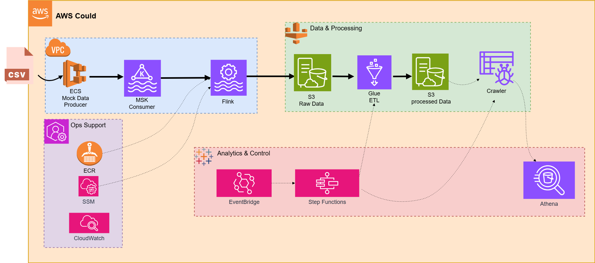

The pipeline follows a robust **Lambda Architecture** variant:

1.  **Ingestion:** Mock Data -> **MSK** (Kafka) -> **Flink** (ECS Fargate) -> **S3** (Raw/Bronze).
2.  **Processing:** **Step Functions** -> **Glue Job** (Spark Aggregation) -> **Glue Crawler** -> **S3** (Processed/Gold).
3.  **Serving:** **Athena** queries the processed data for business insights.

---

## ✨ Key Design Decisions (Highlights)

### 1. Infrastructure as Code (IaC) & Decoupling
*   **Modular Terraform:** Infrastructure is 100% managed via Terraform with clear separation between `Shared` (Persistent) and `Dev` (Ephemeral) layers.
*   **SSM Parameter Store Strategy:** Application versions (Docker Image Tags) are decoupled from Terraform code using SSM Parameters. This allows CI/CD pipelines to update app versions without modifying Infra code.

### 2. Security & Networking (Enterprise Grade)
*   **MSK IAM Authentication:** Enforced **IAM Authentication** and fine-grained **Kafka ACLs** via Terraform, moving away from plaintext credentials to a Role-Based Access Control (RBAC) model.
*   **Private Connectivity:** All compute resources (ECS, MSK, Glue) run in **Private Subnets**. Configured **S3 Gateway Endpoints** to keep data traffic entirely within the AWS internal network, improving security and reducing NAT Gateway costs.

### 3. Robust Orchestration (Step Functions)
*   **Custom Polling Mechanism:** AWS Glue Crawlers are asynchronous by default. I implemented a custom **Wait-and-Retry loop** in Step Functions to poll the Crawler's status, ensuring downstream notifications only trigger when the schema update is actually **SUCCEEDED**.
*   **Synchronous Execution:** Glue Jobs are triggered in `.sync` mode to guarantee data dependency integrity.

### 4. Schema-on-Read & Evolution
*   **Automated Discovery:** Instead of hardcoding table DDLs in Terraform, the platform relies on **Glue Crawlers** to automatically discover schema changes from S3 Parquet files.
*   **Safe Evolution:** Configured Crawler policy (`delete_behavior = LOG`) to prevent accidental metadata deletion during transient S3 issues.

### 5. Cost & Performance Optimization (FinOps)
*   **Ephemeral Environment Strategy:** Implemented a GitHub Actions workflow (`scheduled-destroy`) to automatically tear down the Dev environment nightly. This minimizes idle costs for expensive resources and validates IaC reproducibility daily.
*   **Glue Auto Scaling & Bookmarks:** Enabled **Auto Scaling** for Spark workers to prevent over-provisioning, and activated **Job Bookmarks** to ensure incremental processing (only processing new files).
*   **Spot Instances:** ECS Fargate is configured to use Spot instances for stateless workloads.

---

## 📸 Execution Evidence (Screenshots)

<details>
<summary><strong>1. Infrastructure & Ingestion (Kafka & Flink) - Click to expand</strong></summary>

> *The system successfully buffers events in MSK and processes them via Flink on ECS.*

*   **MSK Cluster Status:**
    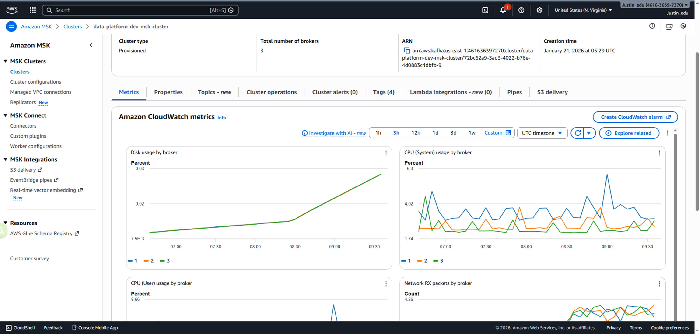

*   **Source Data Generation (Mock Logs):**
    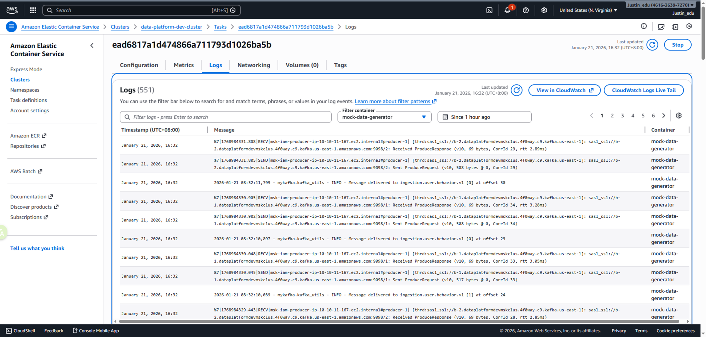

*   **Flink Job Graph (Healthy & Forwarding):**
    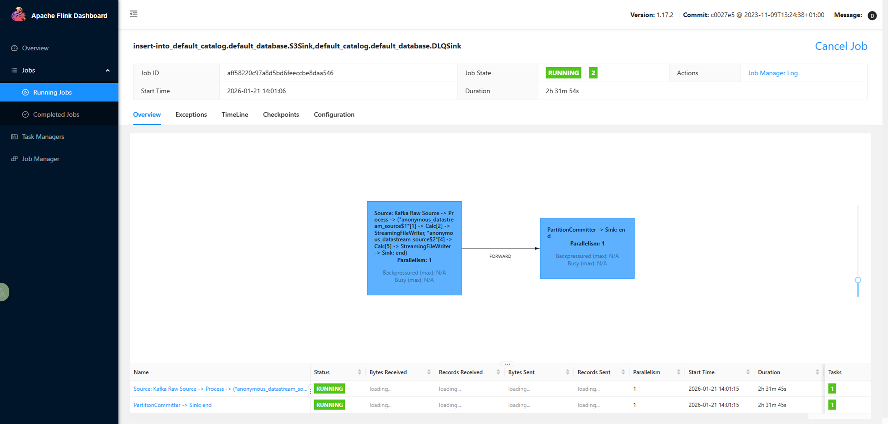

*   **Flink Backpressure (Zero Pressure):**
    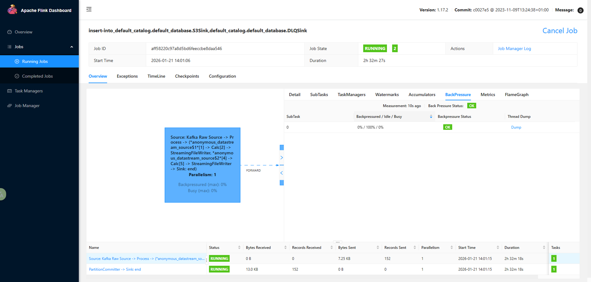

*   **Checkpoint History (Completed):**
    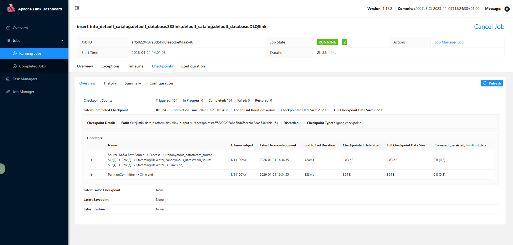
</details>

<details>
<summary><strong>2. Storage & Orchestration (S3 & Step Functions) - Click to expand</strong></summary>

> *Data landing in S3 and being processed by the Orchestration workflow.*

*   **S3 Raw Data Partitioning:**
    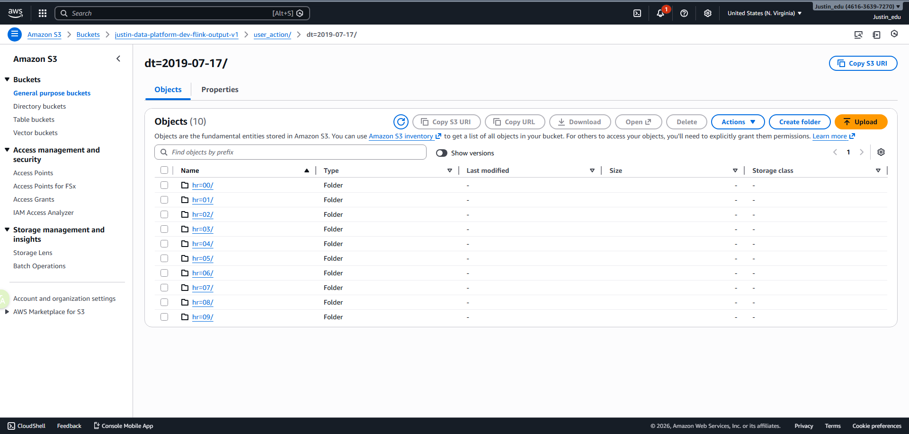

*   **Step Functions Execution Graph (Success):**
    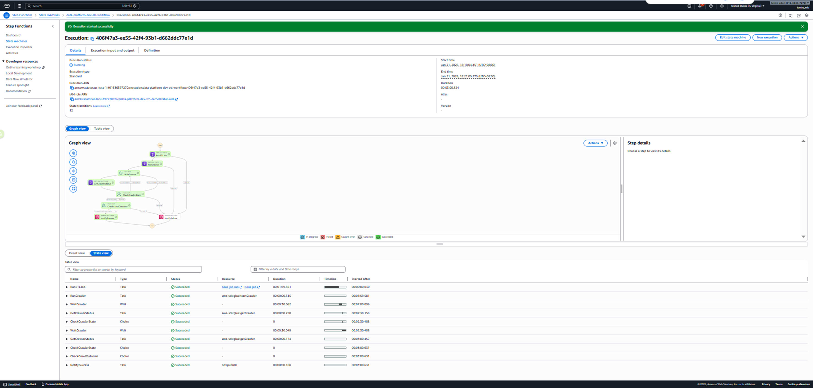

*   **Execution History (Polling Logic Visible):**
    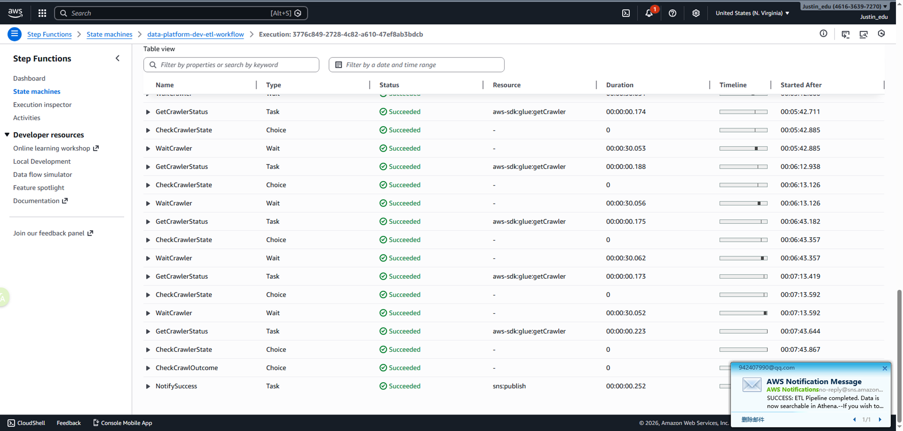
</details>

### 3. Final Business Result (Athena)

**The "Top 3 Products" report generated by the pipeline:**

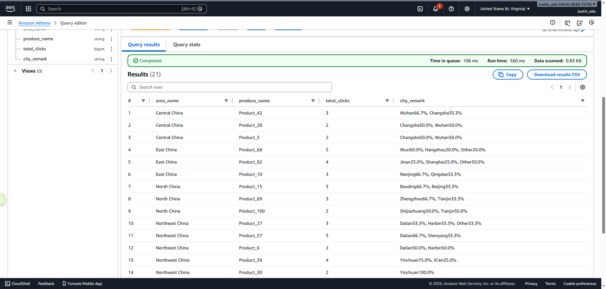

*SQL Query used:*
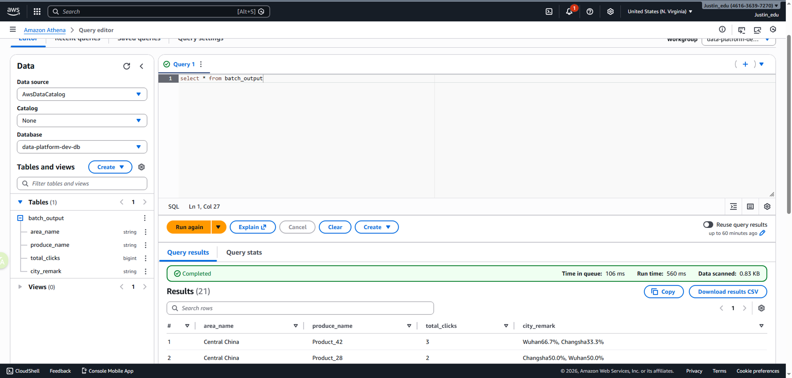

---

## 🚀 How to Deploy

### Prerequisites
*   Terraform v1.5+
*   AWS CLI
*   Access to `ingestion` and `etl` repositories for artifact generation.

### Steps
1.  **Deploy Infrastructure:**
    ```bash
    cd environments/dev
    terraform init && terraform apply
    ```
2.  **Deploy Artifacts & Connect:**
    *   Push Flink Docker Image to ECR via CI/CD.
    *   Upload Glue Scripts to S3 Assets bucket via CI/CD.
    *   (Optional) Use `scripts/connect_flink.ps1` to securely access the private Flink Dashboard.
3.  **Run Pipeline:**
    *   Manually trigger the Step Functions State Machine to process the batch.

---

## 🔮 Future Improvements
*   **Data Quality:** Integrate Glue Data Quality Rulesets within the Spark script to quarantine bad data automatically.
*   **Compaction:** Implement file compaction logic in the Glue Job to optimize S3 small files for Athena performance.
*   **Visualization:** Connect Amazon QuickSight for dashboarding.
